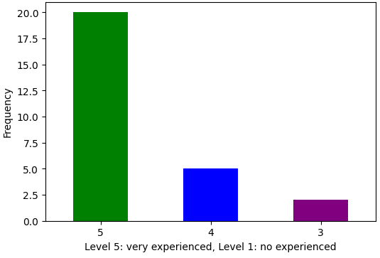
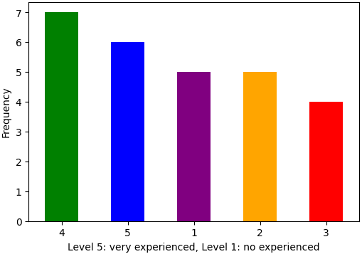
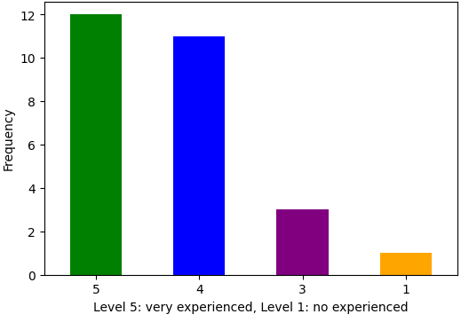
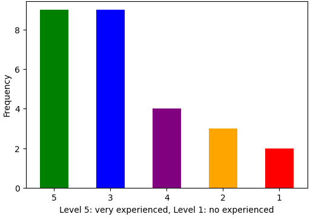
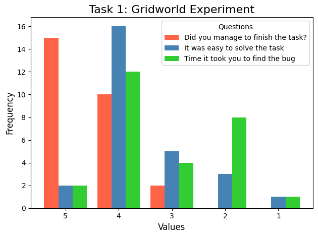
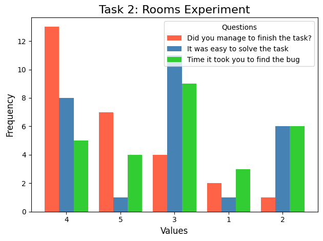
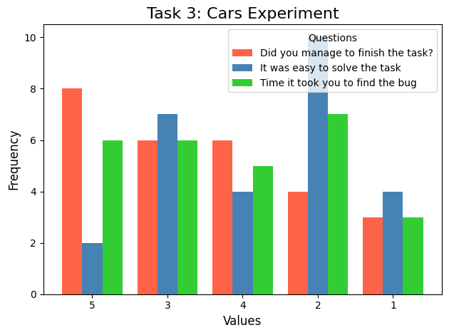

# Flik: A bug's life debugger

This online appendix presents the complete evaluation results for our work on debugging Reinforcement Learning (RL) programs with the Flik back-in-time debugger.

To evaluate Flik we have an empirical study with developers evaluating the debugger on 3 different programming tasks.

## Programming tasks

Currently there are 3 tasks in the evaluation of Flik:

1. Gridworld: An `n x n` matrix with two types of exit cells, traps (which give a bad reward to the agent) and exits (which give a positive reward to the agent). Additionally, there are blocked cells in which the agent cannot enter. The goal of the agent is to reach the exit cell.
1. Rooms: Is a grid-type environment with four smaller grids (a.k.a rooms) embedded into it. The rooms are connected through a door (an unblocked cell). The objective of the agent is to reach a specific point in the rooms (the exit in the top left room).
1. Driving Assistant: A two lane street where an agent must drive at the maximum speed, on the driving lane, overtaking slow driving vehicles, and without crashing.

The description of the three environments can be found [here](https://github.com/larodriguez22/Flik_Experiments/blob/main/Evaluation/README.MD).

## User study

Our initial user study works consists of 27 participants who were asked to complete the three programming tasks. For each task the participants were asked to detect and fix the bug present in the implementation given to them.

In the case of Gridworld, the objective of the task is that the study participants use Flik to navigate through the code and find out why the agent is not learning properly. Eventually, the participants should come out with the solution of increasing the value of ε.

In the case of Rooms, the objective of the task is that the participants use Flik to navigate through the code and find out the reason why the agent is not learning properly, afterwards we expected the participants to figure out a solution adjusting the proper value to update the Q-learning equation.

In the case of Driving Assistant, the objective of the task is that participants explore the program using Flik and observe the behavior of the reward and update it so that the agent can learn to drive appropriately as expected.

Finally the participants where asked to fill in a questionnaire upon completing the tasks. The questionar was divided into three question groups. (1) General knowledge questions, (2) task questions, and (3) usability questions for the tool. for each of the question groups we present the questions and the obtained results.

The questionnaire contains 23 multiple choice questions with a 5-points Likert scale, in which 5 means completely agree, and 1 means completely disagree. One of the questions was a yes or no question, to identify if the participants are willing to use the tool in the future. Finally, there are 10 open-answer questions, to dive deeper into feedback for the tool, and the tasks' complexity.

### 1. General knowledge

#### Questions

This section contains six questions, two of which contains 4 multiple choice questions, and two free text questions.

1. What is your experience using python?
1. Explain your experience using python.
1. What is your experience using debuggers?
1. Explain your experience using debuggers.
1. What is your experience using terminal?
1. What is your experience with Reinforcement Learning programs?

#### Results

Participant | What is your experience using python? | What is your experience using debuggers? | What is your experience using terminal? | What is your experience with Reinforcement Learning programs?
------ | ------ | ------ | ------ | ------
1	|	5	|	5	|	5	|	5
2	|	4	|	3	|	4	|	4
3	|	5	|	4	|	5	|	5
4	|	5	|	1	|	4	|	4
5	|	4	|	3	|	5	|	2
6	|	5	|	5	|	5	|	5
7	|	4	|	1	|	5	|	3
8	|	5	|	1	|	4	|	4
9	|	5	|	2	|	4	|	3
10	|	5	|	2	|	3	|	3
11	|	3	|	2	|	4	|	3
12	|	5	|	4	|	5	|	5
13	|	3	|	3	|	3	|	2
14	|	5	|	4	|	5	|	5
15	|	5	|	1	|	4	|	3
16	|	5	|	5	|	4	|	3
17	|	5	|	5	|	5	|	3
18	|	4	|	1	|	4	|	1
19	|	5	|	4	|	5	|	5
20	|	5	|	4	|	4	|	1
21	|	5	|	3	|	1	|	5
22	|	5	|	4	|	4	|	4
23	|	4	|	4	|	4	|	3
24	|	5	|	5	|	5	|	2
25	|	5	|	2	|	3	|	3
26	|	5	|	2	|	5	|	5
27	|	5	|	5	|	5	|	5

 |  |  |  |
--- | --- | --- | ---
Python experience | Debugger experience | Terminal experience | RL experience

### Task questions

For each of the experiments we ask the same five questions. 3 questions us ethe Likaert scale, and the remaining two of questions are open comments to describe the detected bugs and their solution.

1. Did you manage to finish the task?
1. It was easy to solve the task?
1. Time it took you to find the Bug?
1. Which bugs did you find in the code? (list them separated by commas (,) )
1. What was the main bug in the code? How would you fix it?

The first three questions are used to characterize the solution of the Bugs, while the following two questions help us determine whether the task was satisfactorilly solved. In the third question, related to the time taken to solve the task is meant to give us an impression of the time to relate to how easy was to solve the task. In that question the scale takes 5 as a short time to solve the task (under 6 minutes), and 1 as a long time to solve the task (the full 30 minutes given to solve the task).

#### Results Task 1

Participant | Did you manage to finish the task? | It was easy to solve the task? | Time it took you to find the Bug?
------ | ------ | ------ | ------
1	|	5	|	1	|	2
2	|	5	|	4	|	4
3	|	4	|	2	|	4
4	|	3	|	3	|	4
5	|	4	|	3	|	3
6	|	5	|	4	|	2
7	|	4	|	4	|	3
8	|	5	|	4	|	4
9	|	5	|	5	|	2
10	|	4	|	3	|	4
11	|	3	|	2	|	4
12	|	5	|	3	|	4
13	|	5	|	4	|	3
14	|	5	|	4	|	4
15	|	4	|	4	|	5
16	|	4	|	2	|	2
17	|	5	|	4	|	2
18	|	4	|	4	|	2
19	|	4	|	4	|	4
20	|	4	|	4	|	5
21	|	5	|	5	|	4
22	|	5	|	4	|	4
23	|	5	|	4	|	2
24	|	5	|	4	|	2
25	|	4	|	4	|	3
26	|	5	|	3	|	4
27	|	5	|	4	|	1

#### Results Task 2

Participant | Did you manage to finish the task? | It was easy to solve the task? | Time it took you to find the Bug?
------ | ------ | ------ | ------
1	|	5	|	2	|	2
2	|	5	|	4	|	4
3	|	4	|	3	|	2
4	|	2	|	2	|	4
5	|	4	|	4	|	3
6	|	1	|	1	|	1
7	|	4	|	3	|	3
8	|	4	|	3	|	3
9	|	4	|	3	|	3
10	|	5	|	3	|	2
11	|	3	|	2	|	4
12	|	1	|	2	|	5
13	|	4	|	3	|	2
14	|	4	|	4	|	3
15	|	4	|	4	|	2
16	|	4	|	4	|	3
17 |	5	|	4	|	1
18	|	4	|	4	|	3
19	|	3	|	3	|	3
20	|	4	|	5	|	5
21	|	5	|	3	|	4
22	|	4	|	3	|	4
23	|	5	|	3	|	3
24	|	5	|	4	|	2
25	|	3	|	2	|	1
26	|	4	|	3	|	5
27	|	3	|	2	|	5

#### Results Task 3

Participant | Did you manage to finish the task? | It was easy to solve the task? | Time it took you to find the Bug?
------ | ------ | ------ | ------
1	|	5	|	2	|	2
2	|	5	|	4	|	4
3	|	3	|	2	|	3
4	|	1	|	1	|	5
5	|	4	|	4	|	3
6	|	5	|	4	|	5
7	|	2	|	2	|	3
8	|	4	|	3	|	3
9	|	3	|	2	|	3
10	|	5	|	3	|	1
11	|	3	|	2	|	4
12	|	1	|	1	|	5
13	|	4	|	3	|	2
14	|	3	|	3	|	2
15	|	4	|	3	|	2
16	|	4	|	3	|	3
17	|	5	|	2	|	1
18	|	2	|	2	|	2
19	|	2	|	2	|	2
20	|	4	|	5	|	5
21	|	5	|	3	|	4
22	|	3	|	2	|	5
23	|	5	|	5	|	4
24	|	5	|	4	|	2
25	|	1	|	1	|	1
26	|	3	|	1	|	5
27	|	2	|	2	|	4

 |  |  
--- | --- | --- 
Task 1 | Task 2 | Task 3 

### Usability questions

With respect to usability we ask 12 questions to participants

1. I think I would like to use this system frequently?
1. I find the system unnecesarily complex?
1. I think the system is easy to use?
1. I think I would need technical support to use the system?
1. I find the various functions of the system quite well integrated?
1. I have found too much inconsistency in the system?
1. I think most people would learn to use the system quickly?
1. I found the system quite awkward to use?
1. I have felt very safe using the system?
1. I would need to learn many things before I could handle the system?
1. Would this tool have been useful for a course in RL?
1. Would you recommend this tool?

Participant | I think I would like to use this system frequently? | I find the system unnecesarily complex? | I think the system is easy to use? | I think I would need technical support to use the system? | I find the various functions of the system quite well integrated? | I have found too much inconsistency in the system? | I think most people would learn to use the system quickly? | I found the system quite awkward to use? | I have felt very safe using the system? | I would need to learn many things before I could handle the system? | Would this tool have been useful for a course in RL? | Would you recommend this tool?
------ | ------ | ------ | ------ | ------ | ------ | ------ | ------ | ------ | ------ | ------ | ------ | ------
1	|	5	|	5	|	5	|	5	|	5	|	5	|	5	|	5	|	5	|	5	|	Yes	|	Yes
2	|	5	|	1	|	3	|	5	|	4	|	1	|	3	|	1	|	4	|	1	|	Yes	|	Yes
3	|	5	|	2	|	2	|	5	|	2	|	1	|	2	|	3	|	2	|	5	|	Yes	|	With Improvements
4	|	2	|	3	|	4	|	4	|	4	|	1	|	3	|	4	|	3	|	1	|	Yes	|	Maybe for experts
5	|	4	|	3	|	3	|	4	|	4	|	3	|	3	|	4	|	4	|	4	|	Yes	|	With Improvements
6	|	3	|	4	|	3	|	5	|	4	|	1	|	5	|	4	|	5	|	5	|	Yes	|	Sure, it is very easy to use after you understand
7	|	3	|	4	|	3	|	2	|	4	|	2	|	5	|	3	|	3	|	1	|	Yes	|	For RL cases, yes, so I believe it fulfills its purpose.
8	|	2	|	4	|	2	|	4	|	3	|	2	|	2	|	4	|	2	|	4	|	No	|	With Improvements
9	|	4	|	2	|	3	|	2	|	4	|	2	|	3	|	2	|	4	|	1	|	Yes	|	Yes
10	|	4	|	4	|	3	|	5	|	5	|	3	|	2	|	3	|	2	|	5	|	Yes	|	Maybe for experts
11	|	2	|	2	|	4	|	3	|	4	|	1	|	3	|	2	|	5	|	4	|	Yes	|	Maybe for experts
12	|	3	|	1	|	5	|	4	|	3	|	2	|	1	|	2	|	3	|	3	|	Yes	|	Yes
13	|	2	|	3	|	3	|	1	|	3	|	1	|	4	|	3	|	4	|	1	|	Yes	|	With Improvements
14	|	5	|	2	|	4	|	3	|	5	|	2	|	5	|	3	|	5	|	3	|	Yes	|	With Improvements
15	|	4	|	4	|	2	|	4	|	4	|	1	|	3	|	3	|	2	|	3	|	Yes	|	With Improvements
16	|	2	|	1	|	3	|	1	|	1	|	1	|	5	|	5	|	5	|	1	|	No	|	No
17	|	5	|	3	|	3	|	5	|	5	|	2	|	4	|	3	|	3	|	3	|	Yes	|	Maybe for experts
18	|	3	|	2	|	4	|	3	|	4	|	1	|	2	|	1	|	3	|	1	|	Yes	|	Maybe for experts
19	|	1	|	4	|	2	|	5	|	3	|	1	|	1	|	5	|	1	|	5	|	No	|	No
20	|	5	|	5	|	5	|	4	|	4	|	4	|	5	|	5	|	5	|	5	|	Yes	|	Yes
21	|	4	|	1	|	4	|	2	|	5	|	1	|	4	|	4	|	5	|	5	|	Yes	|	Yes
22	|	3	|	3	|	2	|	4	|	4	|	3	|	2	|	1	|	4	|	5	|	Yes	|	Yes
23	|	2	|	1	|	5	|	1	|	4	|	2	|	5	|	4	|	4	|	1	|	Yes	|	Yes
24	|	5	|	3	|	5	|	3	|	5	|	1	|	4	|	2	|	4	|	1	|	Yes	|	Yes
25	|	2	|	3	|	3	|	5	|	2	|	3	|	2	|	3	|	3	|	4	|	Yes	|	With Improvements
26	|	3	|	4	|	2	|	5	|	3	|	4	|	4	|	4	|	3	|	4	|	Yes	|	Need more testing
27	|	3	|	3	|	4	|	4	|	1	|	4	|	3	|	4	|	4	|	4	|	Yes	|	Yes
